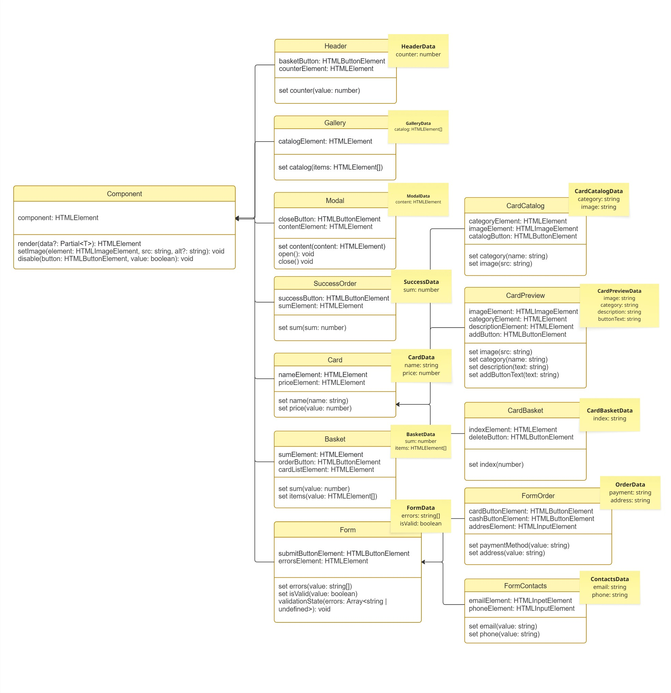

# Проектная работа "Веб-ларек"

Ссылка: https://github.com/yaylnt/weblarek.git

Стек: HTML, SCSS, TS, Vite

Структура проекта:
- src/ - исходные файлы проекта
- src/components/ - папка с JS компонентами
- src/components/base/ - папка с базовым кодом

Важные файлы:
- index.html - HTML-файл главной страницы
- src/types/index.ts - файл с типами
- src/main.ts - точка входа приложения
- src/scss/styles.scss - корневой файл стилей
- src/utils/constants.ts - файл с константами
- src/utils/utils.ts - файл с утилитами

## Установка и запуск
Для установки и запуска проекта необходимо выполнить команды

```
npm install
npm run dev
```

или

```
yarn
yarn dev
```
## Сборка

```
npm run build
```

или

```
yarn build
```
# Интернет-магазин «Web-Larёk»
«Web-Larёk» - это интернет-магазин с товарами для веб-разработчиков, где пользователи могут просматривать товары, добавлять их в корзину и оформлять заказы. Сайт предоставляет удобный интерфейс с модальными окнами для просмотра деталей товаров, управления корзиной и выбора способа оплаты, обеспечивая полный цикл покупки с отправкой заказов на сервер.

## Архитектура приложения

Код приложения разделен на слои согласно парадигме MVP (Model-View-Presenter), которая обеспечивает четкое разделение ответственности между классами слоев Model и View. Каждый слой несет свой смысл и ответственность:

Model - слой данных, отвечает за хранение и изменение данных.  
View - слой представления, отвечает за отображение данных на странице.  
Presenter - презентер содержит основную логику приложения и  отвечает за связь представления и данных.

Взаимодействие между классами обеспечивается использованием событийно-ориентированного подхода. Модели и Представления генерируют события при изменении данных или взаимодействии пользователя с приложением, а Презентер обрабатывает эти события используя методы как Моделей, так и Представлений.

### Базовый код

#### Класс Component
Является базовым классом для всех компонентов интерфейса.
Класс является дженериком и принимает в переменной `T` тип данных, которые могут быть переданы в метод `render` для отображения.

Конструктор:  
`constructor(container: HTMLElement)` - принимает ссылку на DOM элемент за отображение, которого он отвечает.

Поля класса:  
`container: HTMLElement` - поле для хранения корневого DOM элемента компонента.

Методы класса:  
`render(data?: Partial<T>): HTMLElement` - Главный метод класса. Он принимает данные, которые необходимо отобразить в интерфейсе, записывает эти данные в поля класса и возвращает ссылку на DOM-элемент. Предполагается, что в классах, которые будут наследоваться от `Component` будут реализованы сеттеры для полей с данными, которые будут вызываться в момент вызова `render` и записывать данные в необходимые DOM элементы.  
`setImage(element: HTMLImageElement, src: string, alt?: string): void` - утилитарный метод для модификации DOM-элементов ``


#### Класс Api
Содержит в себе базовую логику отправки запросов.

Конструктор:  
`constructor(baseUrl: string, options: RequestInit = {})` - В конструктор передается базовый адрес сервера и опциональный объект с заголовками запросов.

Поля класса:  
`baseUrl: string` - базовый адрес сервера  
`options: RequestInit` - объект с заголовками, которые будут использованы для запросов.

Методы:  
`get(uri: string): Promise<object>` - выполняет GET запрос на переданный в параметрах ендпоинт и возвращает промис с объектом, которым ответил сервер  
`post(uri: string, data: object, method: ApiPostMethods = 'POST'): Promise<object>` - принимает объект с данными, которые будут переданы в JSON в теле запроса, и отправляет эти данные на ендпоинт переданный как параметр при вызове метода. По умолчанию выполняется `POST` запрос, но метод запроса может быть переопределен заданием третьего параметра при вызове.  
`handleResponse(response: Response): Promise<object>` - защищенный метод проверяющий ответ сервера на корректность и возвращающий объект с данными полученный от сервера или отклоненный промис, в случае некорректных данных.

#### Класс EventEmitter
Брокер событий реализует паттерн "Наблюдатель", позволяющий отправлять события и подписываться на события, происходящие в системе. Класс используется для связи слоя данных и представления.

Конструктор класса не принимает параметров.

Поля класса:  
`_events: Map<string | RegExp, Set<Function>>)` -  хранит коллекцию подписок на события. Ключи коллекции - названия событий или регулярное выражение, значения - коллекция функций обработчиков, которые будут вызваны при срабатывании события.

Методы класса:  
`on<T extends object>(event: EventName, callback: (data: T) => void): void` - подписка на событие, принимает название события и функцию обработчик.  
`emit<T extends object>(event: string, data?: T): void` - инициализация события. При вызове события в метод передается название события и объект с данными, который будет использован как аргумент для вызова обработчика.  
`trigger<T extends object>(event: string, context?: Partial<T>): (data: T) => void` - возвращает функцию, при вызове которой инициализируется требуемое в параметрах событие с передачей в него данных из второго параметра.

### Данные

#### Интерфейс IProduct
Интерфейс содержит необходимые данные каждого товара.

Поля интерфейса:
`id: string` - уникальный идентификатор товара.
`description: string` - подробное описание товара, появляющиеся при выборе карточки.
`image: string` - изображение для карточки товара.
`title: string` - название товара.
`category: string` - категория товара.
`price: number | null` - стоимость товара. При её отсутствии товар считается "бесценным" и недоступным к покупке.

#### Интерфейс IBuyer
Интерфейс содержит данные покупателя.

Поля интерфейса:
`payment: TPayment | null` - тип оплаты, возможные варианты: 'card' | 'cash'. Если тип оплаты ещё не выбран или данные пользователя очищены - null.
`email: string` - электронная почта.
`phone: string` - номер телефона.
`address: string` - адрес доставки.

### Модели данных

#### Класс ProductCatalog
Реализует хранение массива всех товаров, выбранной карточки товара. Даёт возможность получать и сохранять список товаров и конкретный товар.

Конструктор:
`constructor(events: EventEmitter)` - конструктор принимает экземпляр брокера событий.

Поля класса:
`products:IProduct[]` - массив товаров.
`previewCard: IProduct | null` - выбранная для просмотра карточка или null, если ещё не выбрана.

Свойства:
`previewProduct: IProduct | null` - геттер и сеттер выбранной карточки товара для подробного просмотра. Позволяет установить и получить эту карточку.

Методы класса:
`setProducts(products: IProduct[]): void` - сохранение массива товаров, полученного в параметрах метода.
`getProducts(): IProduct[]` - получение массиав товаров из модели.
`getById(id: string): IProduct | undefined` - получение одного товара по id.

#### Класс Cart
Реализует функционал корзины: хранение выбранных товаров, добавление и удаление товаров, получение общей стоимости и количества товаров, проверка наличия товара в корзине по id.

Конструктор:
`constructor(events: EventEmitter)` - конструктор принимает экземпляр брокера событий.

Поля класса:
`cartProducts: IProduct[]` - массив товаров, которые пользователь добавил в корзину.

Методы класса:
`getCart(): IProduct[]` - получение массива товаров в корзине. 
`addToCart(product: IProduct): void` - добавление товара в корзину.
`deleteFromCart(id: string): void` - удаление товара из корзины.
`clearCart(): void` - очистка корзины. 
`getSum(): number | null` - получение стоимости всех товаров в корзине. 
`getAmount(): number | null` - получение количества товаров в корзине. 
`checkById(id: string): boolean` - проверка наличия товара в корзине по его id.

#### Класс Buyer
Работает с данными покупателя, обеспечивает их валидацию.

Конструктор:
`constructor(events: EventEmitter)` - конструктор принимает экземпляр брокера событий.

Поля класса:
`payment: TPayment | null` - тип оплаты, возможные варианты: 'card' | 'cash'
`email: string` - электронная почта.
`phone: string` - номер телефона.
`address: string` - адрес доставки.

Методы класса:
`saveData(data: Partial<IBuyer>): void` - сохранение данных в модели.
`getData(): IBuyer` - получение всех данных покупателя
`clearData():  void` - очистка данных покупателя.
`validate(): Partial<Record<keyof IBuyer, string>>` - валидация данных: поле является валидным, если оно не пустое. Если объект пуст, значит валидация пройдена успешно.

### Слой коммуникации

#### Интерфейс IOrder
Содержит данные заказа, включая данные покупателя из интерфейса IBuyer.

Поля интерфейса:
`payment: TPayment | null` - тип оплаты, возможные варианты: 'card' | 'cash'. Если тип оплаты ещё не выбран или данные пользователя очищены - null.
`email: string` - электронная почта.
`phone: string` - номер телефона.
`address: string` - адрес доставки.
`total: number` - общая сумма заказа. 
`items: string[]` - массив из id товаров. 


#### Класс GetPost
Использует композицию, чтобы выполнить запрос на сервер с помощью метода get и будет получать с сервера объект с массивом товаров, отправляет на сервер данные о покупателе и выбранных товарах с помощью метода post. 

Конструктор:
`constructor(api: IApi)` - конструктор принимает объект, реализующий интерфейс IApi, и сохраняет его во внутреннем поле класса.
Этот объект используется для выполнения всех сетевых запросов.

Поля класса:
`api: IApi` - объект для выполнения HTTP-запроса. 

Методы класса:
`getCatalog(): Promise<TProductResponse>` - получает каталог товаров с сервера, выполняя GET-запрос.
`createOrder(order: IOrder): Promise<TOrderResponse>` - отправляет данные заказа на сервер методом POST.

### Слой представления

UML-схема


#### Класс Header

Отвечает за отображение шапки приложения и счетчика товаров в корзине. Расширяет класс Component.

Конструктор:
`constructor(container: HTMLElement, events: IEvents)` - конструктор принимает контейнер для иконки корзины и брокер событий.

Поля класса:
`basketButton: HTMLButtonElement` - кнопка перехода в корзину.
`counterElement: HTMLElement` - элемент отображения количества товаров.

Свойства класса:
`set counter(value: number)` - устанавливает значение счетчика товаров.

#### Тип HeaderData

Тип данных, с которыми работает класс Header.

`counter: number` - количество товаров в корзине.


#### Класс Gallery

Отвечает за отображение списка карточек товаров на главной странице. Расширяет класс Component.

Конструктор:
`constructor(container: HTMLElement)` - конструктор принимает контейнер для галереии карточек.

Поля класса:
`catalogElement: HTMLElement` - контейнер для галереи карточек.

Свойства класса:
`set сatalog(items: HTMLElement[])` - устанавливает список DOM-элементов карточек.

#### Тип GalleryData

Тип данных, с которыми работает класс Gallery.

`catalog: HTMLElement[]` - список карточек.

#### Класс Modal

Управляет модальным окном. Расширяет класс Component.

Конструктор:
`constructor(container: HTMLElement, events: IEvents)` - конструктор принимает контейнер для модального окна и брокер событий.

Поля класса:
`closeButton: HTMLButtonElement` - кнопка закрытия.
`contentElement: HTMLElement` - элемент для контента.

Свойства класса:
`set content(content: HTMLElement)` - устанавливает содержимое модального окна.

Методы класса:
`open(): void` - открывает модальное окно.
`close(): void` - закрывает модальное окно.

#### Тип ModalData

Тип данных, с которыми работает класс Modal.

`content: HTMLElement` - содержимое модального окна.

#### Класс SuccessOrder

Отображает успешное оформление заказа. Расширяет класс Component.

Конструктор:
`constructor(container: HTMLElement, events: IEvents)` - конструктор принимает контейнер для отображения успешного заказа и брокер событий.

Поля класса:
`successButton: HTMLButtonElement` - кнопка подтверждения.
`sumElement: HTMLElement` - элемент для отображения суммы заказа.

Свойства класса:
`set sum(sum: number)` - устанавливает сумму заказа.

#### Тип SuccessData

Тип данных, с которыми работает класс SuccessOrder.

`sum: number` - итоговая сумма заказа.

#### Класс Card

Базовый класс карточки товара. Расширяет класс Component.

Конструктор:
`constructor(container: HTMLElement)` - конструктор принимает контейнер для карточки товара.

Поля класса:
`nameElement: HTMLElement` - элемент названия товара.
`priceElement: HTMLElement` - элемент цены товара.

Свойства класса:
`set name(name: string)` - устанавливает название товара.
`set price(value: number)` - устанавливает цену товара.

#### Тип CardData

Тип данных, с которыми работает класс Card.

`name: string` - название товара.
`price: number` - цена.

#### Класс CardCatalog

Карточка товара в каталоге. Расширяет класс Card.

Конструктор:
`constructor(container: HTMLElement, actions?: ICatalogActions)` - конструктор принимает контейнер для карточки, отображаемой внутри каталога, и объект действий карточки.

Поля класса:
`categoryElement: HTMLElement` - категория товара.
`imageElement: HTMLImageElement` - изображение товара.
`catalogButton: HTMLButtonElement` - кнопка, при нажатии которой открывается подробное описание товара в модальном окне.

Свойства класса:
`set category(name: string)` - устанавливает категорию.
`set image(src: string)` - устанавливает изображение.

#### Тип CardCatalogData

Тип данных, с которыми работает класс CardCatalog.

`category: string` - категория товара.
`image: string` - ссылка на изображение.

#### Класс CardPreview

Карточка товара с подробным описанием, которая открыта в модальном окне. Расширяет класс Card.

Конструктор:
`constructor(container: HTMLElement, events: IEvents)` - конструктор принимает контейнер для карточки, открытой внутри модального окна, и брокер событий.

Поля класса:
`imageElement: HTMLImageElement` - изображение товара.
`categoryElement: HTMLElement` - категория товара.
`descriptionElement: HTMLElement` - описание товара.
`addButton: HTMLButtonElement` - кнопка добавления товара в корзину.

Свойства класса:
`set image(src: string)` - устанавливает изображение товара.
`set category(name: string)` - устанавливает категорию товара.
`set description(text: string)` - устанавливает описание товара.
`set addButtonText(text: string)` - изменяет текст кнопки покупки.
`set disableAddButton(value: boolean)` - управляет доступностью кнопки добавления товара.

#### Тип CardPreviewData

Тип данных, с которыми работает класс CardPreview.

`image: string` - изображение.
`category: string` - категория.
`description: string` - описание.

#### Класс CardBasket

Класс отвечает за отображение карточки товара в корзине. Расширяет класс Card.

Конструктор:
`constructor(container: HTMLElement, actions?: ICardActions)` - конструктор принимает контейнер для карточки в корзине и объект действий карточки.

Поля класса:
`indexElement: HTMLElement` - порядковый индекс товара.
`deleteButton: HTMLButtonElement` - кнопка удаления товара из корзины.

Свойства класса:
`set index(number: number)` - устанавливает порядковый номер.

#### Тип CardBasketData

Тип данных, с которыми работает класс CardBasket.

`index: string` - индекс товара.

#### Класс Basket

Отвечает за отображение корзины. Расширяет класс Component.

Конструктор:
`constructor(container: HTMLElement, events: IEvents)` - конструктор принимает контейнер для корзины и брокер событий.

Поля класса:
`sumElement: HTMLElement` - элемент общей суммы.
`orderButton: HTMLButtonElement` - кнопка оформления заказа.
`cardListElement: HTMLElement` - список товаров.

Свойства класса:
`set sum(value: number)` - устанавливает сумму.
`set items(items: HTMLElement[])` - устанавливает список товаров.
`set disableOrderButton(value: boolean)` - управляет доступностью кнопки оформления заказа.

#### Тип BasketData

Тип данных, с которыми работает класс Basket.

`sum: number` - общая сумма.
`items: HTMLElement[]` - список товаров.

#### Класс Form

Базовый класс формы с валидацией. Расширяет класс Component.

Конструктор:
`constructor(container: HTMLFormElement, events: IEvents)` - конструктор принимает контейнер для формы и брокер событий.

Поля класса:
`submitButtonElement: HTMLButtonElement` - кнопка отправки.
`errorsElement: HTMLElement` - контейнер для ошибок.

Свойства класса:
`set errors(value: string[])` - отображает ошибки.
`set isValid(value: boolean)` - управляет валидностью формы.

Методы класса:
`validationState(errors: Array<string | undefined>): void` - фильтрует массив ошибок, отображает их и управляет состоянием кнопки отправки.

#### Тип FormData

Тип данных, с которыми работает класс Form.

`errors: string[]` - список ошибок.
`isValid: boolean` - валидность формы.

#### Класс FormOrder

Форма оформления заказа с выбором типа оплаты и адресом. Расширяет класс Form.

Конструктор:
`constructor(container: HTMLFormElement, events: IEvents)` - конструктор принимает контейнер для формы с данными о типе оплаты и адресе и брокер событий.

Поля класса:
`cardButtonElement: HTMLButtonElement` - кнопка выбора оплаты картой.
`cashButtonElement: HTMLButtonElement` - кнопка выбора оплаты при получении.
`addressElement: HTMLInputElement` - поле адреса.

Свойства класса:
`set payment(value: string)` - переключает активное состояние кнопок выбора способа оплаты.
`set address(value: string)` - устанавливает значение поля адреса.

#### Тип OrderData

Тип данных, с которыми работает класс FormOrder.

`payment: string` - способ оплаты.
`address: string` - адрес доставки.

#### Класс FormContacts

Форма контактных данных покупателя. Расширяет класс Form.

Конструктор:
`constructor(container: HTMLFormElement, events: IEvents)` - конструктор принимает контейнер для формы с контактами покупателя и брокер событий.

Поля класса:
`emailElement: HTMLInputElement` - поле email.
`phoneElement: HTMLInputElement` - поле телефона.

Свойства класса:
`set email(value: string)` - устанавливает значение поля email.
`set phone(value: string)` - устанавливает значение поля телефона.

#### Тип ContactsData

Тип данных, с которыми работает класс FormContacts.

`email: string` - email
`phone: string` - телефон

### Описание событий

| События | Описание | Данные | Источник |
|---------|----------|--------|----------|
| `basket:click` | Пользователь нажал на иконку корзины в шапке | нет | `Header.ts` |
| `basket:change` | Содержимое корзины изменилось: товар добавлен, удалён или корзина очищена | `{ cart: IProduct[] }` | `Cart.ts` |
| `products:change` | Каталог товаров загружен или обновлён в модели | `{ products: IProduct[] }` | `ProductCatalog.ts` |
| `preview:change` | Пользователь выбрал карточку товара в каталоге для открытия превью | `{ previewCard: IProduct }` | `ProductCatalog.ts` |
| `preview:toggle` | Пользователь нажал кнопку добавления или удаления товара в превью | нет | `CardPreview.ts` |
| `card:add` | Презентер инициировал добавление выбранного товара в корзину | `{ id: string }` | `main.ts` |
| `card:remove` | Презентер инициировал удаление товара из корзины | `{ id: string }` | `main.ts` |
| `modal:open` | Модальное окно открыто | нет | `main.ts` |
| `modal:close` | Модальное окно закрыто (пользователь нажал кнопку закрытия или инициировано закрытие из презентера) | нет | `Modal.ts`, `main.ts` |
| `order:start` | Пользователь нажал кнопку "Оформить" в корзине | нет | `Basket.ts` |
| `order:submit` | Пользователь отправил форму заказа (оплата и адрес) | нет | `FormOrder.ts` |
| `order:change` | Пользователь изменил данные в форме заказа | `{ payment?: TPayment, address?: string }` | `FormOrder.ts` |
| `contacts:submit` | Пользователь отправил форму контактных данных | нет | `FormContacts.ts` |
| `contacts:change` | Пользователь изменил email или телефон в форме контактов | `{ email?: string, phone?: string }` | `FormContacts.ts` |
| `buyer:change` | Данные покупателя в модели изменились и требуется пересчитать состояние форм | `{ buyer: IBuyer }` | `Buyer.ts` |
| `success:close` | Пользователь нажал кнопку "За новыми покупками!" на экране успешного оформления | нет | `SuccessOrder.ts` |

### Презентер

Так как приложение одностраничное, презентер описан без отдельного класса, в файле main.ts.
Он отвечает за загрузку каталога, открытие модальных окон, синхронизацию корзины, валидацию форм заказа и отправку заказа на сервер.


